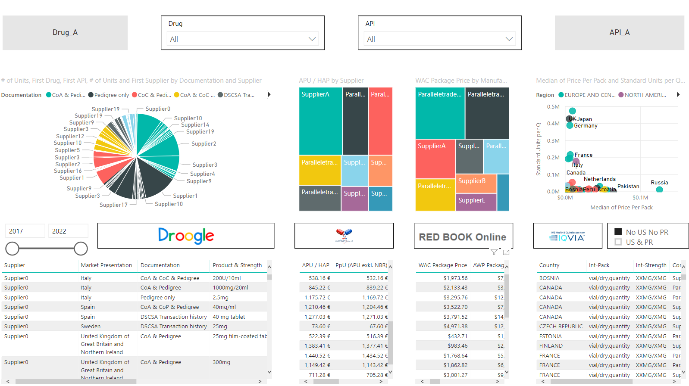

# 4c-Visual
This Documentation is about [_4c-Visual_][1], a tool developed by Dr. Etienne Schmelzer. It allows to clean and cross-reference data from 4 different Databases (SalesForce, IQVIA, Redbook, Lauer).

- [Introduction](#Introduction)
- [Setup & authpass.json file](#Setup)
- [4c-update](#4c-update)
- [4c-Visual](#4c-visual)

<a name = "Introduction"></a>
## Introduction - The Need to simplify our access to Data

_Data driven decision making (DDDM)_ has become one of the fundamental concepts of modern businesses. A modern business leverages all its available data in order to take informed decisions. But leveraging all available data is in general difficult and cumbersome as
the data sources are often decentralized, heterogeneous and chaotic. In order to facilitate the
access to four different data sources (SalesForce, IQVIA, Redbook & Lauer) [_4c-Visual_][1] has been created. [_4c-Visual_][1] is a combination of a Python script ([4c-update][2])/an executable and the Business Intelligence Tool [Power BI (by Microsoft)](https://powerbi.microsoft.com/de-de/).


<iframe width="933" height="700" src="https://app.powerbi.com/view?r=eyJrIjoiMTVjOTc5MGQtMWI1Zi00OTcxLWI5MGYtZmExMmJiODYxMzc0IiwidCI6ImI2N2Q3MjJkLWFhOGEtNDc3Ny1hMTY5LWViZWI3YTZhM2I2NyIsImMiOjN9" frameborder="0" allowFullScreen="true"></iframe>
[_Open in full screen_][1]


<a name = "Setup"></a>
## Setup - Environment

- Install the Environment (mainly Conda + simple_salesforce and some additional packages)  
_Use the [environment.yml](environment.yml) or [requirements.txt](requirements.txt) file._
````
conda env create -f environment.yml
````

- Activate the Environment:
````
conda activate clean
````

### Credentials & Settings: authpass.json
The authpass.json file contains the necessary credentials and stores some
important settings, which are explained below.  
_An example is given in [authpass_example.json](authpass_example.json)_.

- __commands__  
Set to "True" if you would like to clean and cross-reference the rawdataset.
    - droogleupdate: Pulls the Data from SalesForce, cleans and cross-references it
    - lauerupdate: Cleans and cross-references the data from Lauer
    - redbookupdate: Cleans and cross-references the data from Redbook
    - iqviaupdate: Cleans and cross-references the data from iqvia


- __"SalesForce"__  
Contains the Credentials for pulling the Data from Salesforce
    - "global_drug_report" contains the report id of the SalesForce Report


- __"SF-Sandbox" - optional__  
_Optional!!_ Only for development purpose - contains Credentials for a Sandbox.


- __"filepaths"__  
Contains the file paths for the raw data and processed data.  

    - parent contains the file path (to your working directory)
    _I recommend to use a working directory on SharePoint. It will allow you to synchronize your future Power Bi reports._
    - rawdata: Contains your Rawdata
    - destpath: Will contain your processed and cross-referenced files


- __"corrections"__  
Contains the corrections for Market Presentation. You can extend this dictionary.

- __"corrections_iqvia"__  
Contains the corrections for the Iqvia Database - correcting some quantities

- __"SQLServer" - optional__  
_Not needed for 4c-Visual!_ Only for development purpose.
Contains the Settings for MSSQL Server

- __"DjangoSQLServerSettings" - optional__  
    _Not needed for 4c-Visual!_ Only for development purpose.
    Contains the Database Settings for the Django Settings file.


<a name = "4c-update"></a>
### 4c-update
The Python script [4c-update][2] is the core piece of this project. It extracts, cleans and
cross-references the data from the different data sources. _More to come..._


<a name = "4c-visual"></a>
### 4c-Visual
_Some explanation about Power Bi.._


_[4c-Visual][1]_
[][1]


[//]: # (References)

[1]: https://app.powerbi.com/view?r=eyJrIjoiMTVjOTc5MGQtMWI1Zi00OTcxLWI5MGYtZmExMmJiODYxMzc0IiwidCI6ImI2N2Q3MjJkLWFhOGEtNDc3Ny1hMTY5LWViZWI3YTZhM2I2NyIsImMiOjN9
[2]: (4c-update.py)
